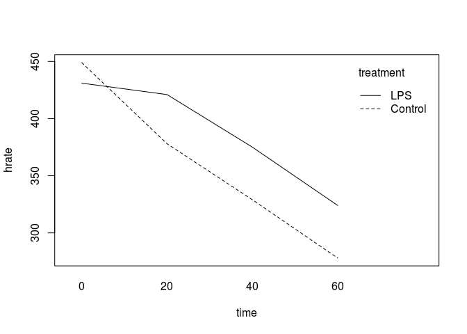

Data Structures within Functional Programming
=============================================

In this step, I am trying to use functional programming in R. This is part of my project for my "Data Technologies" course with Prof. Harner.

Certain strains of the bacterium *Escherichia coli* often found in undercooked foods become a serious health risk if they enter the blood stream. The organism is covered with a chemical compound called a lipopolysaccharide (LPS) that has a toxic effect on the hearts of infected animals. When LPS enters the circulatory system, heart function is affected and heart rate becomes highly elevated. A medical scientist wants to know if the residual effect on heart rate is different for LPS than for other compounds also known to increase heart rate.

An experiment is designed to see how heart rate decreases over time after it has been elevated either with LPS or another compound that will serve as a control. LPS is used on 3 rats and the control compound on another 3. A monitor records continuous measurements (one per second) of the rats’ heart rates, but the measures to be used in the analysis are when each rat’s heart rate reaches a maximum and every 20 minutes thereafter. The experimenter wants to compare the effect of the two compounds on heart rate during the hour after it has reached the maximum number of beats per minute.

1.  Read the coli.csv file into R.

``` r
coli <- read.csv("coli.csv", sep= ",")
head(coli)
```

    ##   treatment rat time hrate
    ## 1       LPS  11    0   416
    ## 2       LPS  11   20   404
    ## 3       LPS  11   40   361
    ## 4       LPS  11   60   307
    ## 5       LPS  12    0   455
    ## 6       LPS  12   20   448

1.  Using the coli data frame, create a table of means where rows represent treatment and columns represent time.

``` r
attach(coli)
(mean.time <- tapply( X = hrate, INDEX = list(treatment,time), FUN = mean))
```

    ##           0  20  40  60
    ## Control 449 378 329 278
    ## LPS     431 421 375 324

1.  Plot the interaction plot, i.e., time is on the x-axis and two segmented lines are drawn---one for treatment level.

``` r
interaction.plot(x.factor=coli$time, trace.factor= coli$treatment, response=coli$hrate,type="l",xlab="time",ylab="hrate",trace.label="treatment", fun=mean)
```



1.  Convert the data frame to wide format.

``` r
library(reshape)
(data.wide <- cast(coli, treatment + rat ~ time , value="hrate")) 
```

    ##   treatment rat   0  20  40  60
    ## 1   Control  11 465 395 339 290
    ## 2   Control  12 439 366 320 266
    ## 3   Control  13 443 373 328 278
    ## 4       LPS  11 416 404 361 307
    ## 5       LPS  12 455 448 396 348
    ## 6       LPS  13 422 411 368 317

``` r
# library(reshape2)
# data.wide <- dcast(coli, treatment + rat ~ time, value.var="hrate")
# data.wide
```

1.  Compute the mean for each treatment level by time from the wide-format data frame.

``` r
s<-split(data.wide,data.wide$treatment)
mean.contrl <- sapply(s$Control[,3:6],mean)
mean.LPS <- sapply(s$LPS[,3:6],mean)
rbind(mean.contrl,mean.LPS)
```

    ##               0  20  40  60
    ## mean.contrl 449 378 329 278
    ## mean.LPS    431 421 375 324

``` r
#If we were allowed to use the long format
tapply(coli$hrate, list(treatment,time),mean)
```

    ##           0  20  40  60
    ## Control 449 378 329 278
    ## LPS     431 421 375 324

1.  Subset the wide-format data frame into two data frames---one for each treatment level.

``` r
data.wide[data.wide$treatment=="Control",]
```

    ##   treatment rat   0  20  40  60
    ## 1   Control  11 465 395 339 290
    ## 2   Control  12 439 366 320 266
    ## 3   Control  13 443 373 328 278

``` r
data.wide[data.wide$treatment=="LPS",]
```

    ##   treatment rat   0  20  40  60
    ## 4       LPS  11 416 404 361 307
    ## 5       LPS  12 455 448 396 348
    ## 6       LPS  13 422 411 368 317

``` r
#OR
LPS <- subset(data.wide,treatment=="LPS")
Control <- subset(data.wide,treatment=="Control")

#OR
split(data.wide,data.wide$treatment) # It is in list format though
```

    ## $Control
    ##   treatment rat   0  20  40  60
    ## 1   Control  11 465 395 339 290
    ## 2   Control  12 439 366 320 266
    ## 3   Control  13 443 373 328 278
    ## 
    ## $LPS
    ##   treatment rat   0  20  40  60
    ## 4       LPS  11 416 404 361 307
    ## 5       LPS  12 455 448 396 348
    ## 6       LPS  13 422 411 368 317

1.  Compute the mean for each data frame by time.

``` r
sapply(LPS[,-1:-2],mean)
```

    ##   0  20  40  60 
    ## 431 421 375 324

``` r
sapply(Control[,-1:-2],mean)
```

    ##   0  20  40  60 
    ## 449 378 329 278

``` r
#OR
#aggregate(.~treatment, LPS, mean)
#aggregate(.~treatment, Control, mean) 
```

1.  Reconstruct the wide-format data frame from the individual treatment data frames.

``` r
rbind(Control, LPS)
```

    ##   treatment rat   0  20  40  60
    ## 1   Control  11 465 395 339 290
    ## 2   Control  12 439 366 320 266
    ## 3   Control  13 443 373 328 278
    ## 4       LPS  11 416 404 361 307
    ## 5       LPS  12 455 448 396 348
    ## 6       LPS  13 422 411 368 317
